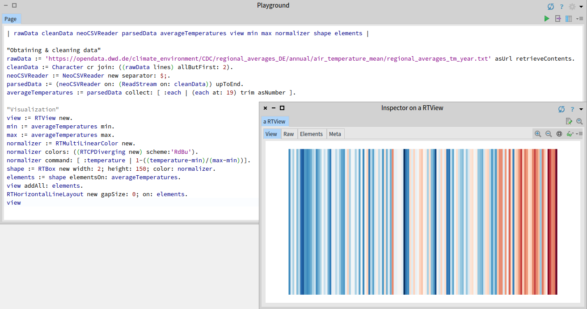

# Exploring warming stripes with Pharo and Roassal

In the wake of the [Global Climate Strike 2019](https://globalclimatestrike.net/), I tried to create [Warming Stripes](https://en.wikipedia.org/wiki/Warming_stripes) for Germany using [Pharo](http://www.pharo.org/) and [Roassal](https://github.com/ObjectProfile/Roassal2). It's only a few lines of code:

```smalltalk
| rawData cleanData neoCSVReader parsedData averageTemperatures view min max normalizer shape elements |

"Obtaining & cleaning data"
rawData := 'https://opendata.dwd.de/climate_environment/CDC/regional_averages_DE/annual/air_temperature_mean/regional_averages_tm_year.txt' asUrl retrieveContents.
cleanData := Character cr join: ((rawData lines) allButFirst: 2).
neoCSVReader := NeoCSVReader new separator: $;.
parsedData := (neoCSVReader on: (ReadStream on: cleanData)) upToEnd.
averageTemperatures := parsedData collect: [ :each | (each at: 19) trim asNumber ].

"Visualization"
view := RTView new.
min := averageTemperatures min.
max := averageTemperatures max.
normalizer := RTMultiLinearColor new.
normalizer colors: ((RTCPDiverging new) scheme:'RdBu').
normalizer command: [ :temperature | 1-((temperature-min)/(max-min))].
shape := RTBox new width: 2; height: 150; color: normalizer.
elements := shape elementsOn: averageTemperatures.
view addAll: elements.
RTHorizontalLineLayout new gapSize: 0; on: elements.
view
```

Use [Pharo 7](https://github.com/pharo-project/pharo), [Roassal 2](https://github.com/ObjectProfile/Roassal2) and [NeoCSV](https://github.com/svenvc/NeoCSV). Copy the code above to a `Playground` and `inspect` it to open the view.   
Data for averages temperatures in Germany comes from [DWD](https://opendata.dwd.de/).


